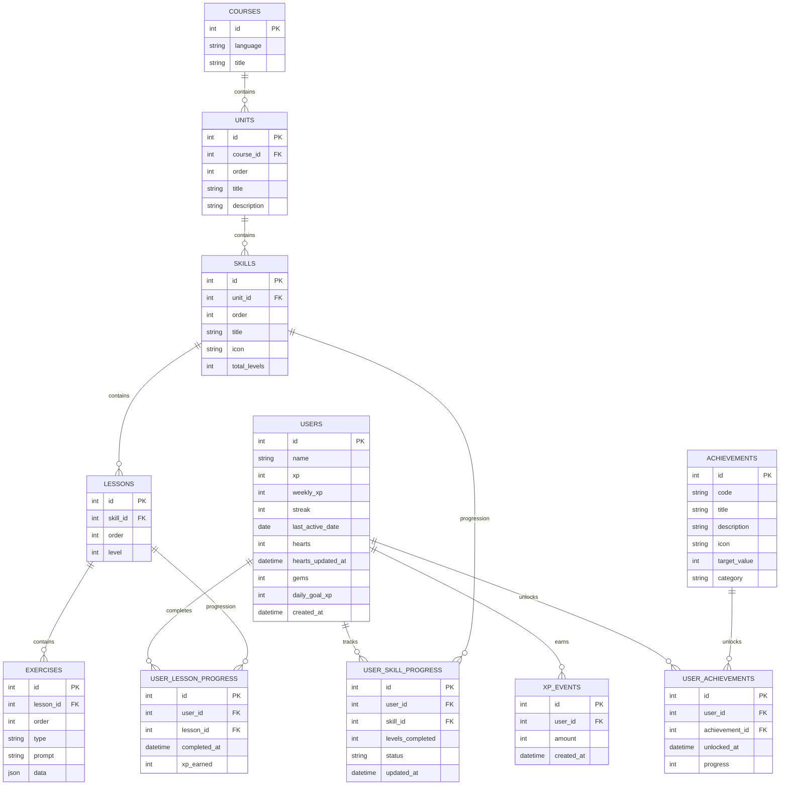
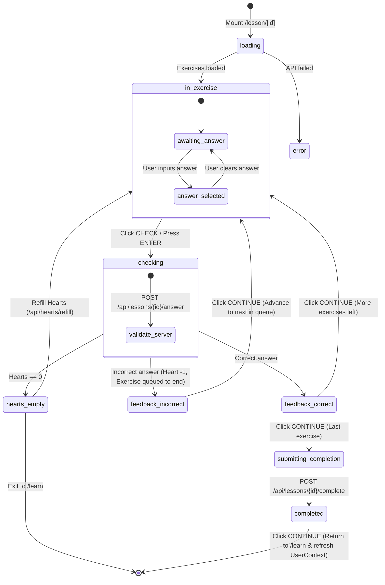

# Duolingo Web App Clone — Master Plan & Technical Specification

## 1. Project Overview & Architecture
This project is a full-stack clone of the Duolingo language learning web application designed with high visual fidelity, engaging gamification, and robust backend mechanics.

### Tech Stack
- **Backend (Phase 1)**: Python 3.12, FastAPI, SQLAlchemy 2.x ORM, SQLite, Pydantic v2, Pytest
- **Frontend (Phases 2 & 3)**: Next.js 16 (App Router), TypeScript, Tailwind CSS v4, Web Audio API, Canvas Confetti
- **Database**: SQLite (file-based relational DB `backend/duolingo.db`)

---

## 2. Repository Layout
```text
ScalarAI_Duolingo/
├── PLAN.md                     # Master architecture & technical specification
├── README.md                   # Full repository documentation & setup instructions
├── frontend/                   # Next.js TypeScript web application (Phases 2 & 3)
│   ├── src/
│   │   ├── app/
│   │   │   ├── globals.css     # Duolingo brand color tokens & 3D styling
│   │   │   ├── layout.tsx      # Root layout with UserProvider & ToastProvider
│   │   │   ├── page.tsx        # Home / Learn path view
│   │   │   ├── learn/page.tsx  # Learn path route alias
│   │   │   ├── leaderboard/page.tsx # Weekly Bronze League ranking
│   │   │   ├── quests/page.tsx # Daily Quests & gem rewards
│   │   │   ├── profile/page.tsx# Learner statistics & achievements
│   │   │   ├── more/page.tsx   # Shop & hearts refill
│   │   │   └── lesson/[id]/page.tsx # Interactive Lesson Player (Phase 3)
│   │   ├── components/
│   │   │   ├── ui/             # Reusable Button, Card, ProgressBar, Modal
│   │   │   ├── layout/         # Sidebar, TopBar, RightPanel, MainLayout
│   │   │   ├── path/           # UnitHeader, SkillNode, SkillPopover, PathView
│   │   │   └── lesson/         # LessonHeader, FeedbackBar, Mascot, LessonCompleteScreen
│   │   │       └── exercises/  # MultipleChoice, TranslateWordBank, MatchPairs, FillInBlank, TypeAnswer
│   │   ├── context/            # UserContext (global user stats) & ToastContext
│   │   ├── hooks/              # usePath, useLessonSession (state machine)
│   │   ├── lib/                # api.ts (typed client), sound.ts (Web Audio synthesizer)
│   │   └── types/              # TypeScript types matching Pydantic models
│   └── package.json
└── backend/                    # FastAPI backend service (Phase 1)
    ├── README.md               # Backend installation & execution guide
    ├── requirements.txt        # Python dependency manifest
    ├── seed.py                 # Database initialization & seed script
    ├── app/
    │   ├── main.py             # FastAPI entrypoint, CORS & auto-seed lifecycle
    │   ├── config.py           # Application settings & database paths
    │   ├── database.py         # SQLAlchemy engine, session maker & declarative Base
    │   ├── models/             # SQLAlchemy ORM models (User, Course, Unit, Skill, Lesson, Exercise, etc.)
    │   ├── schemas/            # Pydantic schemas for request/response validation
    │   ├── routers/            # REST API endpoints (/api/me, /api/path, /api/lessons, etc.)
    │   └── services/           # Encapsulated game logic (hearts, streaks, grading, XP)
    └── tests/                  # Pytest automated test suite (23 passing unit tests)
```

---

## 3. Database Schema Specification

### Relational Schema Diagram


---

## 4. Exercise Types & Grading Rules

1. **`multiple_choice`**:
   - `prompt`: Question or sentence to translate.
   - `data`: Options list, single correct option, explanation.
   - Client gets: Options list (shuffled), question.
   - Server checks: Exact string match with target choice.

2. **`translate_word_bank`**:
   - `prompt`: Sentence in source language with character speech bubble.
   - `data`: Tokenized word bank tiles + distractors, ordered target tokens.
   - Client gets: Word bank tiles (shuffled).
   - Server checks: Array sequence or joined string matching target translation.

3. **`match_pairs`**:
   - `prompt`: Match vocabulary terms between two columns.
   - `data`: List of key-value term pairs.
   - Client gets: Left column and randomized right column.
   - Server checks: All pairs correctly mapped.

4. **`fill_in_blank`**:
   - `prompt`: Sentence with blank placeholder (e.g., `Ella ___ una manzana.`).
   - `data`: Sentence text, option choices, correct word.
   - Client gets: Sentence text with blank, options list.
   - Server checks: Selected word fills the blank correctly.

5. **`type_answer`**:
   - `prompt`: Prompt sentence to translate manually via keyboard with Spanish accents row.
   - `data`: Target sentence, list of acceptable alternate spellings/punctuation.
   - Client gets: Prompt sentence.
   - Server checks: Case-insensitive, accent-tolerant, punctuation-trimmed string comparison.

---

## 5. Core Game Mechanics

### Streak System
- Evaluated on lesson completion:
  - If `last_active_date == today`: Same day activity. Streak preserved (no double-increment).
  - If `last_active_date == today - 1 day`: Consecutive day. Streak incremented by +1.
  - If `last_active_date < today - 1 day` or `None`: Inactivity gap. Streak resets to 1.
  - `last_active_date` updated to `today`.

### Lazy Heart Regeneration System
- Maximum hearts: 5.
- Regeneration rate: 1 heart per 30 minutes (1800 seconds).
- Deductions: -1 heart on incorrect answer. If hearts reach 0, response sets `lesson_failed = True` and prompts the "Out of Hearts" modal.

### Experience Points (XP) & Daily Goals
- Standard lesson completion awards **10 XP**.
- Perfect lesson (zero mistakes) awards **+5 bonus XP** (Total **15 XP**).
- Recorded as an immutable `XPEvent` entry and compared against `daily_goal_xp`.

---

## 6. Phase 3: Lesson State Machine Architecture

The lesson player is driven by the [`useLessonSession`](file:///e:/Downloads%20new/projects_work/ScalarAI_Duolingo/frontend/src/hooks/useLessonSession.ts) custom state hook:


